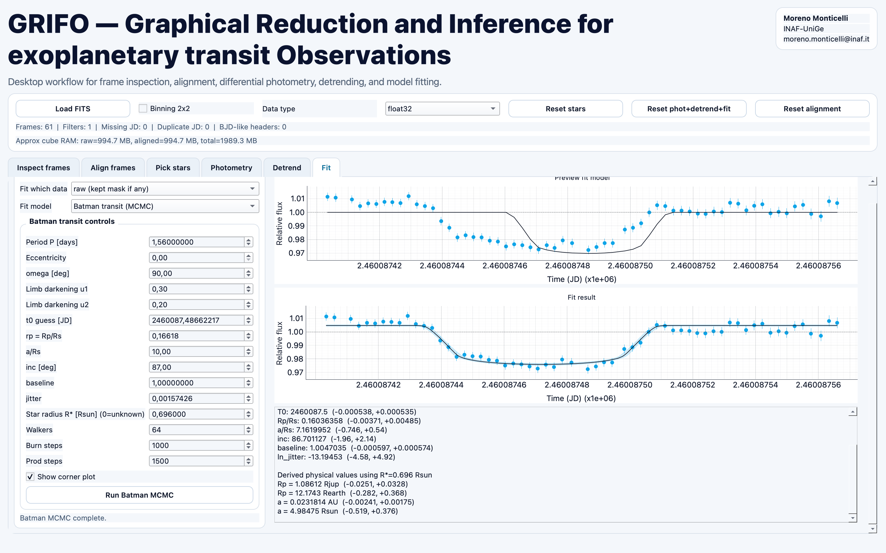

# GRIFO

GRIFO (Graphical Reduction and Inference for exoplanetary transit Observations) is a desktop GUI for photometric analysis using **PySide6 + pyqtgraph**.

## Features

- FITS loading and frame inspection
- Frame alignment
- Target/comparison star selection
- Aperture differential photometry
- Detrending
- Final fitting step with:
  - Batman transit MCMC
  - Polynomial fit (general source light curves)

## Requirements

- Python 3.9+
- Packages listed in `requirements.txt`

## Installation

```bash
python -m venv .venv
source .venv/bin/activate
pip install -r requirements.txt
```

## Run

```bash
python GRIFO.py
```

## Interface Preview



## Citation

If you use the Batman transit fitting mode in GRIFO, please cite the original `batman` package paper:

- Kreidberg, L. (2015), *Publications of the Astronomical Society of the Pacific*, 127, 1161-1165.
- DOI: [10.1086/683602](https://doi.org/10.1086/683602)

BibTeX:

```bibtex
@article{Kreidberg2015,
  author = {Kreidberg, Laura},
  title = {batman: BAsic Transit Model cAlculatioN in Python},
  journal = {Publications of the Astronomical Society of the Pacific},
  volume = {127},
  number = {957},
  pages = {1161--1165},
  year = {2015},
  doi = {10.1086/683602}
}
```
